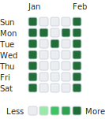

# git-mosaic

`git-mosaic` is a local, preview-first CLI that turns a 7-row pixel image into a
deterministic plan of dated Git commits. Designing and previewing are separate
from touching a repository, and the tool never pushes.

> [!IMPORTANT]
> The generated history is contribution artwork, not a record of development
> activity. Disclose that fact in repositories created with this tool. GitHub's
> final contribution levels and colors are calculated by GitHub and can differ
> from the local preview.

The current release supports JSON intensity matrices, PNG/JPEG/WebP images,
crisp pixel-font text, import fit verdicts, terminal and SVG previews, new or
existing repositories, empty or file commits, safe resumable application, an
optional GitHub contribution snapshot, and a local web editor.



## Requirements and installation

- Node.js 22 or newer
- Git 2.30 or newer
- pnpm 11 for installing from this repository

The package is currently a workspace package and is not yet documented as a
published npm release. From a checkout of this repository, install and build it
from source:

```bash
cd git-mosaic
corepack enable
pnpm install
pnpm build
node apps/cli/dist/index.js --help
```

In the examples below, `gm` means:

```bash
alias gm='node apps/cli/dist/index.js'
```

You may replace `gm` with `git-mosaic` when the executable is on your `PATH`.
The alias syntax above is for Bash-compatible shells.

## Quick start

Create a project for a past year. Future dates are rejected unless planning is
explicitly run with `--allow-future`.

```bash
gm init demo --year 2025 --timezone America/Sao_Paulo
```

Import a PNG, JPEG, or WebP image. The source is copied into the project and
converted to a 7-row intensity map.

```bash
gm import image ./art.png --project ./demo --fit contain
gm preview --project ./demo
gm preview --project ./demo --theme light --output ./demo/exports/preview.svg
```

Text is stamped directly onto calendar cells, so its strokes are never blurred
by image resampling:

```bash
gm import text "Loading..." --project ./demo
gm preview --project ./demo            # shows exactly what you drew
gm preview --project ./demo --estimate # GitHub-style quartile estimate
```

Create and inspect a deterministic plan. Use an email associated with the
GitHub account that should receive contribution credit.

```bash
gm plan \
  --project ./demo \
  --repo ../demo-history \
  --author-name "Example User" \
  --author-email "user@example.com"

gm plan inspect ./demo/plans/latest.json
gm apply ./demo/plans/latest.json --dry-run
```

Only after reviewing the project, absolute repository path, branch, commit
count, and checksum, materialize the new repository:

```bash
gm apply ./demo/plans/latest.json --init-repository
```

In a terminal you must type the plan ID. For intentional non-interactive use,
add `--yes`. The command creates local commits but does not configure a remote
or push. Publishing remains a manual user action.

## Existing repositories

Existing repositories require a clean worktree, the planned branch, an exact
base commit, and explicit authorization:

```bash
HEAD_SHA=$(git -C ../existing-repo rev-parse HEAD)

gm plan \
  --project ./demo \
  --repo ../existing-repo \
  --repository-mode existing \
  --expected-head "$HEAD_SHA" \
  --branch main \
  --author-name "Example User" \
  --author-email "user@example.com"

gm apply ./demo/plans/latest.json --dry-run --allow-existing-repository
gm apply ./demo/plans/latest.json --allow-existing-repository
```

If a target has remotes, both dry-run and apply also require
`--allow-repository-with-remotes`. This is an acknowledgement only;
`git-mosaic` still never pushes.

## GitHub-aware preview

An optional GraphQL import records contributions already present during the
project period. Tokens are read from `GITHUB_TOKEN` or stdin and are never
written to the project:

```bash
GITHUB_TOKEN=... gm github import --username octocat --project ./demo
# or
printf '%s' "$GITHUB_TOKEN" | gm github import \
  --username octocat --project ./demo --token-stdin
```

The resulting snapshot is embedded in `mosaic.json` and also written to
`snapshot.github.json`; later previews and plans work offline. See
[GitHub preview and tokens](docs/github-preview.md).

## Local web editor

The web editor runs only on `127.0.0.1` and reuses the same project, preview,
planning, and Git execution modules as the CLI. Build and start it from the
workspace:

```bash
pnpm --filter @git-mosaic/web-local build
pnpm --filter @git-mosaic/web-local start
```

Then open `http://127.0.0.1:4173`. The editor supports keyboard-accessible
painting, numeric intensity labels, zoom, undo/redo, image and text import, fit
verdicts with an explicit force retry, artistic/estimate preview modes, SVG
export, English/Portuguese UI, plan review, dry-run, and confirmed application.
It uses a random local session header, same-origin checks, a request-size limit,
and a strict Content Security Policy. It never pushes.

## What the preview means

The default preview is WYSIWYG: drawn intensities `0..4` are shown one-to-one as
GitHub's five visual levels. Pass `--estimate` to rank the resulting positive
commit counts into approximate quartiles instead. Intensity values `0..4` map to
`0, 1, 4, 10, 20` planned commits by default. Imported GitHub days retain
observed levels only when no new commits are planned; mixed days are estimates.
GitHub can render a different result because its algorithm, eligibility rules,
account email association, repository status, and later activity are outside
this tool's control.

## Safety model

- project creation, imports, previews, and planning do not run Git commands;
- plan content is schema-validated and protected by a SHA-256 checksum;
- apply requires a clean target and explicit confirmation;
- new repositories, existing repositories, and repositories with remotes each
  have separate authorization gates;
- local hooks and commit signing are disabled for generated commits;
- author, committer, timestamps, messages, and trailers are explicit;
- every commit carries plan/step/date trailers for verification and resume;
- no command performs `git push`, force-pushes, or rewrites existing history.

Read [Git generation, safety, and resume](docs/git-generation.md) before using
`apply` on a repository you care about.

## Documentation

- [Architecture](docs/architecture.md)
- [Calendar model](docs/calendar-model.md)
- [GitHub preview and tokens](docs/github-preview.md)
- [Git generation, safety, and resume](docs/git-generation.md)
- [File formats](docs/file-formats.md)
- [Troubleshooting](docs/troubleshooting.md)
- [Contributing](CONTRIBUTING.md)
- [Security policy](SECURITY.md)

## Limitations

- Preview colors show the selected artistic or estimate mode, not a promise of
  GitHub's rendering.
- The CLI does not push, create a GitHub repository, or verify that GitHub will
  count a commit.
- Image import supports PNG, JPEG, and WebP only; SVG and animated formats are
  not accepted.
- The week always starts on Sunday and the canvas always has seven rows.
- Text supports A-Z, 0-9, space, and `. ! ? - :` at three font sizes; text that
  cannot fit at the smallest legible font is refused with remedies rather than
  rendered illegibly.
- There is no PNG preview export, automatic branch discovery, or commit-count
  optimizer in the current release.
- GitHub snapshot import needs network access and a token; cached projects remain
  usable offline.

## Disclosure template

Repositories containing generated history can include this text:

> This repository's commit history was generated by git-mosaic as contribution
> artwork. It does not represent the timing or volume of software development.

## License

[MIT](LICENSE)
